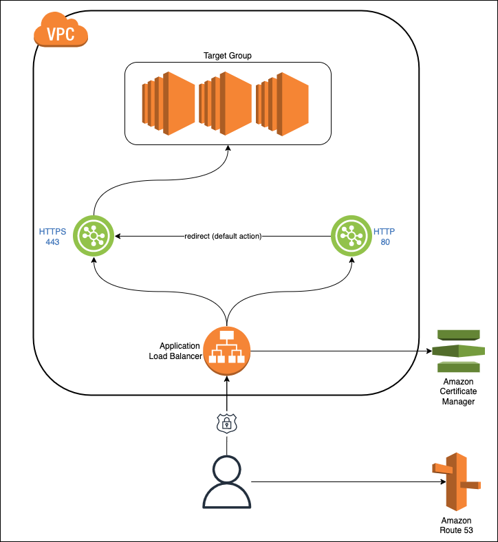

# Webapp Ingress Terraform Module

This module provides setup of the AWS resources needed for web traffic ingress. The module takes care of the following:

1. Setting up SSL certificate with automatic verification for the application sub-domain 
2. Setting up application load balancer, target group and attaching the SSL certificate to the HTTPS listener
3. Setting up S3 bucket for storing load balancer access logs
4. Setting up the retention policy for the access logs

## Architecture diagram



## Usage

```hcl
module "app_ingress" {
  source                      = "git::https://github.com/gaussb-labs/terraform-aws-webapp-ingress-module.git?ref=v2.2.0"
  environment                 = "production"
  domain_name                 = "example.com"
  app_subdomain_name          = "app.example.com"
  vpc_id                      = "vpc-012"
  alb_access_logs_bucket_name = "alb-access-logs"
  alb_access_logs_expiry_days = 365
  alb_access_logs_prefix      = "prod"
  alb_aws_account_arn         = "arn:aws:iam::123456789987:root"
  alb_default_static_response = {
    content_type         = "text/html"
    encoded_message_body = base64encode(file("${path.module}/static/404.html"))
    status_code          = "404"
  }
  alb_name                                     = "load-balancer"
  alb_subnets                                  = ["subnet_1a", "subnet_1b"]
  app_port                                     = 3000
  http_https_ingress_sg_id                     = "sg-ingress-http-https-id"
  target_group_healthcheck_matcher             = "200"
  target_group_healthcheck_path                = "/api/health"
  target_group_healthcheck_healthy_threshold   = 3
  target_group_healthcheck_unhealthy_threshold = 2
  target_group_healthcheck_enabled             = true
  target_group_healthcheck_protocol            = "HTTP"
  target_group_healthcheck_interval            = 30
  target_group_healthcheck_timeout             = 5
  enable_failover_policy                       = true
  primary_record_healthcheck_id                = "primary_healthcheck_id"
  secondary_record_alias_name                  = "secondary_alias_name"
  secondary_record_zone_id                     = "secondary_zone_id"
  secondary_record_healthcheck_id              = "secondary_healthcheck_id" 
}
```

This module provides two listeners out of the box:

1. __HTTP listener__:
This listener redirects the traffic to the HTTPS listener by default with HTTP Status `301(Permanent)`.

2. __HTTPS listener__:
This listener is responsible for SSL termination of the traffic and forwards it to the target group defined. A default response can be setup via input variables.

Additional listener rules can be added to both these listeners outside this module.
It is also possible to add new listeners to the application load balancer.
The module outputs the application load balancer ARN and the listeners' ARN.

## Requirements

| Name | Version |
|------|---------|
| <a name="requirement_terraform"></a> [terraform](#requirement\_terraform) | \>= 1.2.0 |
| <a name="requirement_aws"></a> [aws](#requirement\_aws) | ~> 4.16 |
| <a name="requirement_cloudinit"></a> [cloudinit](#requirement\_cloudinit) | \>=2.2.0 |

## Providers

| Name | Version |
|------|---------|
| <a name="provider_aws"></a> [aws](#provider\_aws) | ~> 4.16 |

## Modules

No modules.

## Resources

| Name | Type |
|------|------|
| [aws_acm_certificate.app_subdomain](https://registry.terraform.io/providers/hashicorp/aws/latest/docs/resources/acm_certificate) | resource |
| [aws_acm_certificate_validation.certificate_validation](https://registry.terraform.io/providers/hashicorp/aws/latest/docs/resources/acm_certificate_validation) | resource |
| [aws_lb.alb](https://registry.terraform.io/providers/hashicorp/aws/latest/docs/resources/lb) | resource |
| [aws_lb_listener.app_http](https://registry.terraform.io/providers/hashicorp/aws/latest/docs/resources/lb_listener) | resource |
| [aws_lb_listener.app_https](https://registry.terraform.io/providers/hashicorp/aws/latest/docs/resources/lb_listener) | resource |
| [aws_lb_listener_rule.app](https://registry.terraform.io/providers/hashicorp/aws/latest/docs/resources/lb_listener_rule) | resource |
| [aws_lb_target_group.app](https://registry.terraform.io/providers/hashicorp/aws/latest/docs/resources/lb_target_group) | resource |
| [aws_route53_record.alb_record](https://registry.terraform.io/providers/hashicorp/aws/latest/docs/resources/route53_record) | resource |
| [aws_route53_record.secondary_alb_record](https://registry.terraform.io/providers/hashicorp/aws/latest/docs/resources/route53_record) | resource |
| [aws_route53_record.app_validation](https://registry.terraform.io/providers/hashicorp/aws/latest/docs/resources/route53_record) | resource |
| [aws_s3_bucket.alb_access_logs](https://registry.terraform.io/providers/hashicorp/aws/latest/docs/resources/s3_bucket) | resource |
| [aws_s3_bucket_acl.alb_access_logs_private](https://registry.terraform.io/providers/hashicorp/aws/latest/docs/resources/s3_bucket_acl) | resource |
| [aws_s3_bucket_lifecycle_configuration.alb_access_log_retention_policy](https://registry.terraform.io/providers/hashicorp/aws/latest/docs/resources/s3_bucket_lifecycle_configuration) | resource |
| [aws_s3_bucket_policy.alb_access_log_access](https://registry.terraform.io/providers/hashicorp/aws/latest/docs/resources/s3_bucket_policy) | resource |
| [aws_iam_policy_document.alb_access_log](https://registry.terraform.io/providers/hashicorp/aws/latest/docs/data-sources/iam_policy_document) | data source |
| [aws_route53_zone.zone](https://registry.terraform.io/providers/hashicorp/aws/latest/docs/data-sources/route53_zone) | data source |

### Inputs

| Name                                             	| Description                                                                                                                              	| Type           	| Default        	| Required 	|
|--------------------------------------------------	|------------------------------------------------------------------------------------------------------------------------------------------	|----------------	|----------------	|----------	|
| environment                                      	| The deployment environment. environment is added as prefix to the resources generated by this module.                                    	| `string`       	| n/a            	| yes      	|
| domain_name                                      	| The root domain name of the organization.                                                                                                	| `string`       	| n/a            	| yes      	|
| app_subdomain_name                               	| The domain name for the public facing app. Application load balancer will be attached to this domain.                                    	| `string`       	| n/a            	| yes      	|
| alb_name                                         	| Name of the application load balancer.                                                                                                   	| `string`       	| n/a            	| yes      	|
| alb_access_logs_prefix                           	| S3 bucket prefix for application load balancer access logs.                                                                              	| `string`       	| n/a            	| yes      	|
| alb_access_logs_expiry_days                      	| Number of days to retain application load balancer access logs.                                                                          	| `number`       	| n/a            	| yes      	|
| app_port                                         	| The port number application is running on.                                                                                               	| `number`       	| n/a            	| yes      	|
| alb_default_static_response                      	| The default static response to return if no rules match in alb.                                                                          	| `object`       	| n/a            	| yes      	|
| alb_default_static_response.content_type         	| The response content type. Eg: text/html, text/plain etc.                                                                                	| `string`       	| n/a            	| yes      	|
| alb_default_static_response.encoded_message_body 	| Base64 encoded response.                                                                                                                 	| `string`       	| n/a            	| yes      	|
| alb_default_static_response.status_code          	| HTTP status code to be returned.                                                                                                         	| `string`       	| n/a            	| yes      	|
| vpc_id                                           	| Identifier for AWS VPC where the resources in the module will be created.                                                                	| `string`       	| n/a            	| yes      	|
| http_https_ingress_sg_id                         	| Identifier for the security group allowing access to HTTP(80) and HTTPS(443) ingress. This is used for ingress traffic to load balancer. 	| `string`       	| n/a            	| yes      	|
| alb_subnets                                      	| List of subnet identifiers to associate subnets to load balancer.                                                                        	| `list(string)` 	| n/a            	| yes      	|
| alb_aws_account_arn                              	| AWS account ARN for the account containing load balancer.                                                                                	| `string`       	| n/a            	| yes      	|
| alb_access_logs_bucket_name                      	| S3 bucket name which will be used to store load balancer access logs. Prefix  will be added. The bucket name should be unique globally.  	| `string`       	| n/a            	| yes      	|
| target_group_healthcheck_enabled                 	| Enable/Disable target health check. boolean values are valid. Defaults to true.                                                          	| `bool`         	| true           	| no       	|
| target_group_healthcheck_healthy_threshold       	| Number of consecutive health check successes required before considering an unhealthy target healthy. Defaults to 3.                     	| `number`       	| 3              	| no       	|
| target_group_healthcheck_unhealthy_threshold     	| Number of consecutive health check failures required before considering the target unhealthy. Defaults to 3.                             	| `number`       	| 3              	| no       	|
| target_group_healthcheck_interval                	| Approximate amount of time, in seconds, between health checks of an individual target. Defaults to 30.                                   	| `number`       	| 30             	| no       	|
| target_group_healthcheck_matcher                 	| Response codes to match when checking for a healthy responses from a target.                                                             	| `string`       	| n/a            	| yes      	|
| target_group_healthcheck_path                    	| Destination for the health check request.                                                                                                	| `string`       	| n/a            	| yes      	|
| target_group_healthcheck_port                    	| Port to use to connect with the target. Valid values are any valid port or "traffic-port". Defaults to "traffic-port".                   	| `string`       	| "traffic-port" 	| no       	|
| target_group_healthcheck_protocol                	| Protocol to use to connect with the target. Defaults to "HTTP".                                                                          	| `string`       	| "HTTP"         	| no       	|
| target_group_healthcheck_timeout                 	| Amount of time, in seconds, during which no response means a failed health check. Defaults to 5.                                         	| `number`       	| 5              	| no       	|
| enable_failover_policy                            | Should enable/disable Failover policy for the subdomain record                                                                            | `bool`            | `false`           | no        |
| primary_record_healthcheck_id                     | For Failover Routing policy only. Healthcheck Id of primary record.                                                                       | `string`          | `null`            | no        |
| secondary_record_alias_name                       | For Failoverrouting policy only. Alias name for secondary record.                                                                         | `string`          | `null`            | no        |
| secondary_record_healthcheck_id                   | For Failover Routing policy only. Healthcheck Id of secondary record.                                                                     | `string`          | `null`            | no        |
| secondary_record_zone_id                          | For Failoverrouting policy only. Zone Id for secondary record.                                                                            | `string`          | `null`            | no        |

### Outputs

| Name                   	| Description                                                      	|
|------------------------	|------------------------------------------------------------------	|
| alb_arn                	| ARN for the application load balancer provisioned by the module. 	|
| alb_http_listener_arn  	| ARN for the application load balancer HTTP listener              	|
| alb_https_listener_arn 	| ARN for the application load balancer HTTPS listener             	|
| app_target_group_arn 	    | ARN for the application target group             	                |
| app_subdomain_acm_cert_arn| ARN for the application subdomain SSL certificate managed by ACM  |

## License

MIT Licensed. See [LICENSE](https://github.com/gaussb-labs/terraform-aws-webapp-ingress-module/blob/main/LICENSE) for full details.
